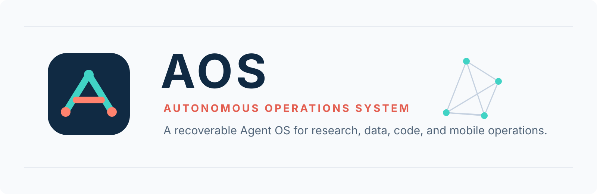

<p align="center">
  
</p>

<p align="center">
  <a href="./README.zh-CN.md">中文</a> ·
  <a href="./docs/INSTALL.md">Documentation</a> ·
  <a href="./LICENSE">MIT License</a>
</p>

<p align="center">
  <a href="./.github/workflows/rust-ci.yml"></a>
  
  =20.19 or >=22.12">
  
  
</p>

# AOS

AOS is a Web-first, multi-tenant Agent OS. Its primary user entry is **Super Assistant**, which combines general chat, live tool use, durable memory, deep research, data attribution, SQL knowledge, files, Skills, MCP, and repository work in one recoverable session.

The active product surface is the Web UI plus the Rust WebServer. Legacy command-line entry points are not part of the current distribution.

The recommended release is **AOS Offline** for macOS, Linux, or Windows x64. It
bundles the WebUI, server, ONNX Runtime, and a pinned multilingual local
Embedding model, so AOS and NL2SQL semantic retrieval can start without MySQL or
an Embedding API and without downloading a model at runtime.

## 3-Minute Wow Demo

Run the local demo stack and open the Dashboard:

```bash
./scripts/aos-demo-start.sh
```

The script starts AOS with a local SQLite platform database. The schema is created automatically on first boot.

The UI and local demo data start without an enterprise system. Real model answers require at least one enabled `chat` API key, configured after setup under **System -> API Keys**.

The Dashboard shows four click-through demo cards:

- **Fix a frontend bug** - open Code Studio, inspect real files, generate a candidate Diff, run tests, and apply only after review.
- **Diagnose ROI drop** - ask “Why did Indonesia ROI drop 10% yesterday?” and get SQL, evidence cards, root causes, confidence, and follow-ups.
- **Create daily revenue report** - generate an automation draft, dry run, preview, confirm, run now, and receive an in-app notification.
- **Ask WatchDog** - inspect running, stale, failed, and cancelling AgentOps tasks with shared WebUI/Bot evidence.

The demo does not require enterprise systems. It uses local SQLite, bundled fallback evidence, demo prompts, and the same AgentOps/Trace surfaces used by real tasks.

Bot Router smoke assets are included under `examples/bot-router` so you can verify the unified Bot entrance with a local generic webhook before connecting Feishu/Lark, Slack, WeCom, Telegram, Discord, DingTalk, or WhatsApp.

Detailed demo guide:

- [Open-source Wow Demo](./docs/OPEN_SOURCE_DEMO.md)
- [开源 Wow Demo](./docs/OPEN_SOURCE_DEMO.zh-CN.md)

## Repository Shape

- `rust/` - Rust workspace for the WebServer and core service crates.
- `webui/` - React + Vite Web UI.
- `docs/` - architecture notes, operational runbooks, SQL helpers, and design records.
- `docker-compose.yml` - first-run Docker stack for the WebServer and Web UI.

## Quick Start With Docker

```bash
./scripts/generate-env.sh
docker compose up --build
```

Open `http://localhost:3000`. On a fresh database, AOS redirects to the setup flow so you can create the first tenant and administrator account.

After setup, add one enabled `chat` model key in **System -> API Keys**. A chat-scoped key is automatically considered by Super Assistant, deep research, and other chat-model fallbacks in priority order; users do not need to duplicate the same key for every menu.

## Quick Start Without Docker

```bash
# Check the complete Rust/Node/Python/MCP toolchain. Use --install to install
# missing tools on macOS, Debian/Ubuntu, or Fedora/RHEL.
./scripts/setup-environment.sh --check
./scripts/setup-environment.sh --install

# Optional but recommended for reliable Skill repository scans.
export AOSD_GITHUB_TOKEN=your_token

# Builds missing release artifacts, generates .env, and starts AOS.
./scripts/aos-start.sh
unset AOSD_GITHUB_TOKEN
```

Open `http://localhost:3000`. The release server serves the WebUI and API from
one process and stores all platform state in `.aos-data/` by default.

```bash
./scripts/aos-stop.sh
./scripts/reset-local-data.sh --all
./scripts/aos-package.sh
```

The archive is named `aos-offline-<version>-<os>-<arch>.tar.gz`. Windows x64
packages are built on Windows with `scripts/aos-package-windows.ps1` and produce
an `aos-offline-<version>-windows-x86_64.zip` archive. API Embedding is optional:
AOS prefers a healthy API profile when configured and falls back to its isolated
local profile on timeout, rate limiting, or provider failure.

To upgrade without losing tenants, credentials, sessions, tasks, workspaces, or
indexes, extract the new same-platform archive beside the current installation
and run the new package's `scripts/aos-upgrade.sh --target <current-install>`
(`aos-upgrade.ps1 -Target <current-install>` on Windows). The script backs up
the complete data directory and `.env`, verifies the release manifest, and
automatically rolls back if the new server does not become ready.

See [the zero-to-one deployment guide](./docs/OPEN_SOURCE_DEPLOYMENT.zh-CN.md)
and [the complete manual test guide](./docs/OPEN_SOURCE_TEST_GUIDE.zh-CN.md).
Model discovery, provider-specific reasoning parameters, verification, and safe fallback are documented
in [Model Capability Profiles](./docs/MODEL_CAPABILITY_PROFILES.md) and
[模型能力档案](./docs/MODEL_CAPABILITY_PROFILES.zh-CN.md).

Compose binds API and Web ports to `127.0.0.1` by default. For remote deployment, expose the Web service deliberately with `AOS_BIND_HOST=0.0.0.0` behind TLS, a firewall, and a reverse proxy.

Docker Compose starts:

- A local SQLite database at `/data/aos.db`; the server applies embedded migrations before accepting requests.
- `aos-server` on `http://localhost:3001`.
- `aos-web` on `http://localhost:3000`, proxying `/api` and `/ws` to the server.

## Local Development

### Backend

```bash
cd rust
./scripts/dev_web_server.sh run
```

The backend listens on `0.0.0.0:3001` by default unless changed with `--addr`.

### Web UI

```bash
cd webui
npm install
npm run dev
```

Open the Vite URL printed by the command, usually `http://localhost:5173`.

## Common Development Commands

```bash
# Backend compile check
cd rust
./scripts/dev_web_server.sh check

# Backend tests for the shipped product surface
cargo test --workspace --all-features

# Frontend production build
cd webui
npm run build

# Frontend typecheck for CI or pre-merge validation
npm run typecheck

# Full Web UI validation
npm run build:ci

# Full backend product surface
cd ../rust
AOS_WEB_SERVER_FEATURES=full ./scripts/dev_web_server.sh check
```

## Main Modules

- Super Assistant - the unified conversation surface for chat, live lookup, deep research, data attribution, files, memory, and tool loops.
- Data Analysis - analyst-facing data exploration, datasource management, and the SQL knowledge base.
- Code Studio - repository understanding, candidate workspaces, diff review, tests, and previews.
- Automation and AgentOps - scheduled work, durable task execution, recovery, trace, and WatchDog.
- Extensions - Skills marketplace, MCP servers, and Hook management.
- System - API keys, configuration, users, tenants, governance, and Bot Gateway.

## Bot Gateway

Bot Gateway binds AOS capabilities to external chat platforms and notification channels.

Supported platform adapters include:

- DingTalk: Stream inbound plus group-bot outbound Webhook/signing.
- Telegram: polling inbound plus `sendMessage` outbound.
- Feishu/Lark: local long-connection event inbound plus custom-bot Webhook or OpenAPI outbound; no public callback URL is required for local development.
- WeCom: local AI Bot WebSocket inbound plus group-bot Webhook outbound; no public callback URL is required for local development. AI Bot credentials are inbound credentials; test sends still use a group bot Webhook.
- Slack: local Socket Mode inbound plus Incoming Webhook or Bot Token outbound; no public callback URL is required for local development.
- Discord: local Gateway WebSocket inbound plus Discord Webhook or Bot Token outbound; no public callback URL is required for local development.
- WhatsApp: Cloud API Webhook inbound plus Cloud API or relay Webhook outbound. WhatsApp does not provide a first-party polling/socket inbound mode for Cloud API bots, so local testing needs a tunnel or relay.
- Generic Webhook: custom relay inbound/outbound adapter.

Local-first setup:

- Feishu/Lark: create an internal app, enable long-connection event subscription, subscribe to message receive events, then create an AOS channel with `inbound_mode=auto` or `stream` and fill App ID/App Secret. Verification Token and Encrypt Key are optional. Outbound replies/notifications can use either a custom bot Webhook or App ID/App Secret plus a default chat ID through OpenAPI.
- WeCom: create an AI Bot, create an AOS channel with `inbound_mode=auto` or `stream`, and fill Bot ID/Bot Secret. Token and EncodingAESKey are optional when your WeCom bot configuration requires them. Outbound replies/notifications use a group bot Webhook.
- Slack: enable Socket Mode on the Slack app, create an App-Level Token with `connections:write`, subscribe to message events, then create an AOS channel with `inbound_mode=auto` or `socket` and fill the App-Level Token. Outbound replies/notifications can use Incoming Webhook or Bot Token + Channel ID.
- Discord: create a bot, enable the message content intent if you need raw text, then create an AOS channel with `inbound_mode=auto` or `socket` and fill Bot Token. Outbound replies/notifications can use Discord Webhook or Bot Token + Channel ID.
- For daily local use, run the already built `web-server` binary with your `.env`; rebuild only after Rust code or feature flags change.

## AgentOps / WatchDog

AgentOps is the control plane for AOS Agent tasks. WebUI, Bot, RD, AI Chat, Super Adversarial, PM Assistant, and NL2SQL adapters can write a shared task timeline into `agent_tasks` and `agent_task_events`.

WatchDog is available from:

- WebUI: open `/watchdog` to view live summary, capability health, task board, task inspector, and Ask WatchDog.
- Bot Gateway: bind the `watchdog` capability to Feishu/Lark, WeCom, Slack, or another supported platform for mobile status checks.

Bot capability binding is contract-driven through:

```http
GET /api/v1/agent-ops/capabilities
```

Standard capability keys:

```text
aos_router
ai_chat
super_adversarial
watchdog
pm_assistant
rd_agent
nl2sql
generic_ai
```

`aos_router` is the recommended unified Bot entrance. `generic_ai` is only a lightweight fallback; new Bot agents should prefer `aos_router` plus explicit capability bindings, and mobile operations teams should bind `watchdog`.

See:

- [AgentOps / WatchDog Design](./docs/AGENTOPS_WATCHDOG_DESIGN.md)
- [Bot Capability Contract](./docs/BOT_CAPABILITY_CONTRACT.md)
- [WatchDog Runbook](./docs/WATCHDOG_RUNBOOK.md)
- [Enterprise Bot Gateway](./docs/BOT_GATEWAY_ENTERPRISE.md)
- [Bot Platform Smoke Tests](./docs/BOT_PLATFORM_SMOKE.md)
- [Bot Router Smoke Assets](./examples/bot-router/README.md)
- [Adapter And OpenAPI Examples](./docs/ADAPTER_OPENAPI_EXAMPLES.md)
- [Router / WatchDog Golden Eval Set](./docs/evals/router_watchdog_golden.jsonl)
- [Capability Matrix](./docs/CAPABILITY_MATRIX.md)

## Documentation

- [Usage](./USAGE.md)
- [Installation](./docs/INSTALL.md)
- [Rust workspace](./rust/README.md)
- [Architecture](./docs/ARCHITECTURE.md)
- [Container workflow](./docs/container.md)
- [Contributing](./CONTRIBUTING.md) / [贡献指南](./CONTRIBUTING.zh-CN.md)
- [Security Policy](./SECURITY.md) / [安全政策](./SECURITY.zh-CN.md)
- [Code of Conduct](./CODE_OF_CONDUCT.md) / [社区行为准则](./CODE_OF_CONDUCT.zh-CN.md)
- [Open Source Release Checklist](./OPEN_SOURCE_RELEASE_CHECKLIST.md) / [开源发布清单](./OPEN_SOURCE_RELEASE_CHECKLIST.zh-CN.md)
- [AOS vs Codex evaluation protocol](./docs/AOS_VS_CODEX_EVAL.md)

The checked-in deterministic evaluation fixture verifies wiring and regression contracts; it is not empirical proof that AOS outperforms Codex. Release claims about answer quality require the same blinded online cases to be run against both systems, including grounding, follow-up memory, recovery, latency, and token cost.

## License And Notices

AOS is distributed under the MIT License. Third-party and upstream notices, including the initial MIT-licensed source distribution used to bootstrap the project, are kept in [`NOTICE.md`](./NOTICE.md) and [`LICENSE`](./LICENSE).

Product documentation describes AOS as the current Web-first project. Legal notices remain separate and accurate.
