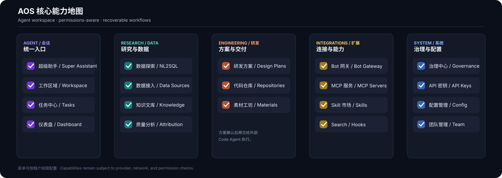

  

  <a href="./README.md">English</a> ·
  <a href="./docs/OPEN_SOURCE_DEPLOYMENT.zh-CN.md">部署文档</a> ·
  <a href="./LICENSE">Apache-2.0 License</a>

  
  
  =20.19 或 >=22.12">
  
  

# AOS

AOS 是 **Agent Operating System**：一个 Web-first、多租户的 Agent 工作空间。它围绕可恢复会话组织通用对话、证据检索、数据探索、记忆、文件、Skill、MCP、长任务恢复，以及外部 IM 入口。

> **项目状态：** AOS 当前处于持续回归测试和开源准备阶段。本仓库只提交源码、文档、测试和打包脚本；预编译 AOS Offline 包不会放进 Git 历史，准备好后才会作为 GitHub Release 单独发布。部分能力需要模型 Key、第三方服务或公网回调，不能把所有适配器理解为已经在所有平台达到生产稳定性。

## AOS 解决什么问题

- **可恢复的 Agent 会话**：普通问答、工具调用、长任务和追问共享上下文。
- **深度研究**：多源证据、冲突处理、有界执行，以及没有外部搜索时仍可交付的回退结论。
- **数据工作**：数据源感知的 NL2SQL、语义召回、SQL 知识库、数据归因和下钻。
- **移动端 Agent 入口**：通过 Bot 网关连接支持的社交平台，并投递任务状态和结果。
- **渐进式研发方案设计**：先生成可审查的核心设计，确认后再生成可修改的实现计划和 Task，交给外部代码 Agent 执行。
- **Skill 和 MCP 扩展**：可安装、可检查、可治理的能力扩展。

AOS 的目标是让 Agent 工作可理解、可追踪、可恢复。不同模型供应商和 IM 平台的能力取决于其 API、权限和网络条件，项目不会对尚未验证的场景作过度承诺。

  

这张图是产品能力地图，不代表每个部署都默认开放所有能力。租户权限、模型供应商、网络条件和功能成熟度以对应文档和实际配置为准。

## 架构概览

    WebUI / 外部 Bot
            |
            v
       Rust WebServer  --->  SQLite 平台数据
            |
            +--> Agent runtime 与可恢复会话
            +--> 模型供应商与可选联网增强
            +--> 数据源、Skill、MCP 和代码仓库适配器

AOS 平台自身使用 SQLite；业务数据库作为 NL2SQL 外部数据源配置，不是启动 AOS 的依赖。一个 AOS 进程负责一个本地数据目录。

## 从源码开始

贡献者最短路径是 Docker：

    ./scripts/generate-env.sh
    docker compose up --build

打开 http://localhost:3000 完成 setup。进入 System -> API Keys 配置一个启用的 chat 场景 Key 后，再进行需要模型的操作。

原生开发：

    ./scripts/setup-environment.sh --check
    ./scripts/aos-start.sh

将服务暴露到 localhost 之外前，请先阅读部署手册：

- [安装说明](./docs/INSTALL.md)
- [开源部署手册](./docs/OPEN_SOURCE_DEPLOYMENT.zh-CN.md)
- [完整测试手册](./docs/OPEN_SOURCE_TEST_GUIDE.zh-CN.md)

## 仓库结构

- rust/：Rust workspace、API、runtime、Agent 编排和 WebServer。
- webui/：React + Vite 前端。
- docs/：架构、部署、安全、集成和测试文档。
- eval/、examples/：可重复的 fixture 和小型集成示例。
- scripts/：环境检查、启动/停止、升级和打包脚本。

## 开发检查

    cd rust
    cargo fmt --all
    cargo check -p web-server
    cargo test --workspace --all-features

    cd ../webui
    npm ci
    npm run typecheck
    npm run build:ci

仓库中的测试手册覆盖 Bot 网关、数据归因、NL2SQL 配置和渐进式研发方案设计流程。

## 配置边界

- 模型凭据按租户在 API 密钥中配置，不进入源码或 Git 历史。
- Search 扩展和 MCP 是可选增强；未配置时使用内置回退路径。
- Skill 安装把包视为不可信输入，并经过安全检查和权限边界。
- 长任务会持久化状态和事件，客户端重连后可以恢复上下文；外部 IM 投递仍受各平台 API 政策影响。

## 文档

- [架构说明](./docs/ARCHITECTURE.md)
- [模型能力档案](./docs/MODEL_CAPABILITY_PROFILES.zh-CN.md)
- [长任务与移动端设计](./docs/AGENTOPS_WATCHDOG_DESIGN.md)
- [Bot 能力契约](./docs/BOT_CAPABILITY_CONTRACT.md)
- [Bot 网关企业配置](./docs/BOT_GATEWAY_ENTERPRISE.md)
- [NL2SQL 设计说明](./docs/DESIGN_DATASOURCES_NL2SQL.md)
- [研发方案设计中心](./docs/AOS_ENGINEERING_DESIGN_CENTER.zh-CN.md)
- [输出易读性规范](./docs/READABILITY_SPEC.md)
- [安全政策](./SECURITY.zh-CN.md)
- [贡献指南](./CONTRIBUTING.zh-CN.md)

## 发布包

AOS Offline 是面向 macOS、Linux 和 Windows x64 的独立构建产物，不会提交到本仓库。维护者会在完成回归、生成校验和升级说明后，将归档包、SHA-256 和升级说明发布到 GitHub Releases。在此之前请使用源码方式运行。

## 许可证

AOS 使用 [Apache License 2.0](./LICENSE)。第三方和上游归属说明见 [NOTICE.md](./NOTICE.md)。
